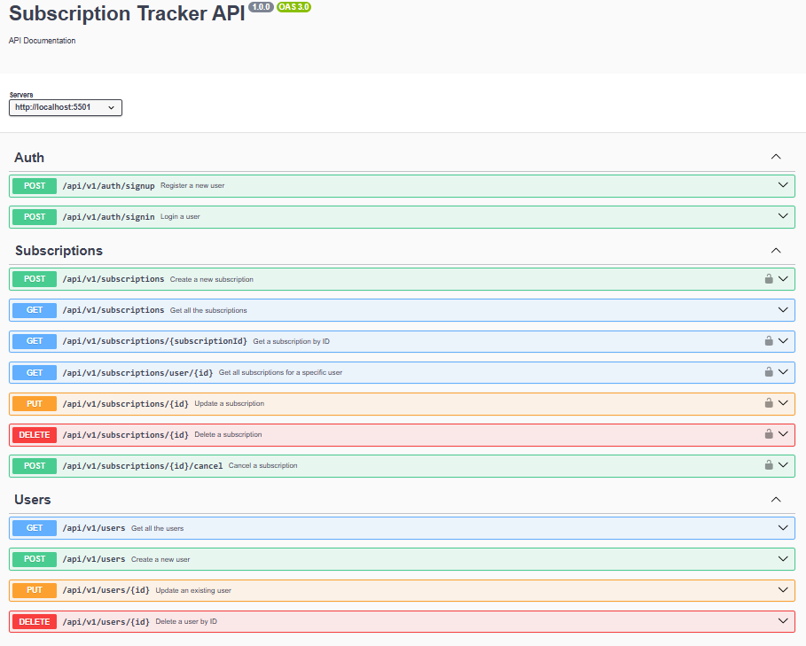

<h1 align="center">Subscription Tracker</h1>

Production-ready, Dockerized RESTful API with full CRUD for users and subscriptions, secured with JWT authentication, rate-limited by Arcjet, and integrated with QStash for scheduling workflow reminders.

## Features

- **User & Subscription Management** – Enables full CRUD operations for users and their subscriptions.
- **JWT Authentication** – Secures user sessions with JSON Web Token-based authentication.
- **MongoDB Atlas Integration** – Stores and manages data in a scalable cloud-hosted database.
- **Postman-tested Endpoints** – Ensures all routes function reliably through comprehensive API testing.
- **Arcjet Rate Limiting** – Protects the API from abuse and overuse by enforcing rate limits.
- **Upstash** - Provides serverless data storage and supports reminder workflows
- **Swagger API Documentation** – Provides interactive and complete API documentation for developers.
- **Docker Containerization** – Ensures consistent deployment with Dockerized backend infrastructure.

## Tech Stack
- Node.js  
- Express.js (web framework)  
- MongoDB (database)  
- REST API  
- Swagger (API documentation)  
- Postman (API testing)  
- Arcjet (security and rate limiting)
- Upstash (reminder workflow and serverless data storage)


## Getting Started
Follow these steps to get a local copy of the project up and running:


### Prerequisites

- [Node.js](https://nodejs.org/en/download/) installed (version 14 or higher recommended)
- [npm](https://www.npmjs.com/get-npm) or [yarn](https://yarnpkg.com/getting-started/install) package manager
- Git installed
- MongoDB installed and running locally or access to a MongoDB cloud instance
- (Optional) [Postman](https://www.postman.com/) or any API testing tool to test endpoints
- (Optional) [Swagger](https://swagger.io/tools/swagger-ui/) for interactive API documentation
- (Optional) [Arcjet](https://arcjet.com/) for API security and rate limiting

### Installation

1. **Clone the repository**  
```bash
git clone https://github.com/msaakaash/subscription-tracker.git
cd subscription-tracker
```

2. **Install dependencies**  
Run the following command to install all required packages, including Express and MongoDB drivers:  
```bash
npm install
```  
_or if you use yarn:_  
```bash
yarn install
```

3. **Run the application**  
Start the API server using:  
```bash
npm start
```  
_or if you have a custom start script, replace accordingly_

> **Optional (for development):** Use `nodemon` to automatically reload the server on code changes:  
```bash
nodemon run dev
```

4. **Test the API**  
> **Note:** By default, the server runs on `http://localhost:5501`. Use Postman, curl, or Swagger to interact with the API.

## API Documentation

The API is documented using **Swagger** for ease of use and clarity.

> You can access the Swagger UI at:  
> `http://localhost:5501/api-docs` _(or your configured path)_

### Swagger UI Screenshot



